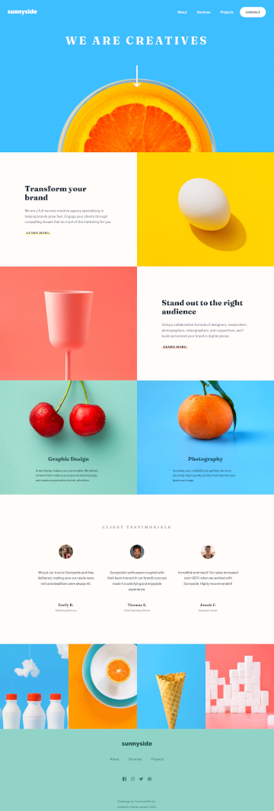

# Frontend Mentor - Sunnyside agency landing page solution

This is a solution to the [Sunnyside agency landing page challenge on Frontend Mentor](https://www.frontendmentor.io/challenges/sunnyside-agency-landing-page-7yVs3B6ef). Frontend Mentor challenges help you improve your coding skills by building realistic projects.

## Table of contents

- [Overview](#overview)
  - [Description](#description)
  - [Screenshot](#screenshot)
  - [Links](#links)
- [The process](#the-process)
  - [Built with](#built-with)
  - [Observations](#observations)
  - [Useful resources](#useful-resources)
- [Author](#author)

## Overview

### Description

Beautifully designed landing page featuring working responsive and accessible mobile menu. Made with Progressive Enhancement in mind, so the navigation is not hidden if the user blocks JavaScript. Helpful and informative articles linked below.

### Screenshot

### Links

- [Repo](...)
- [Live Site](...)

## My process

### Built with

- Semantic HTML5 markup
- CSS custom properties
- CSS Grid
- Flexbox
- Mobile-first workflow
- JavaScript

### Observations

- use min-height for flex-item if vertical overflow

### Useful resources

- [My Basic Template](https://github.com/je-jo/basic-template) pretty much based on Stephanie Eckless' [HTML / Sass Jumpstart](https://github.com/5t3ph/html-sass-jumpstart) but much simpler;
- [Clippy](https://bennettfeely.com/clippy/) - A tool to generate clip-paths easily.

## Author

- [Github](https://github.com/je-jo)
- [Frontend Mentor](https://www.frontendmentor.io/profile/je-jo)
- [Codepen](https://codepen.io/je-jo)
- [Twitter](https://twitter.com/jelena_jo_)